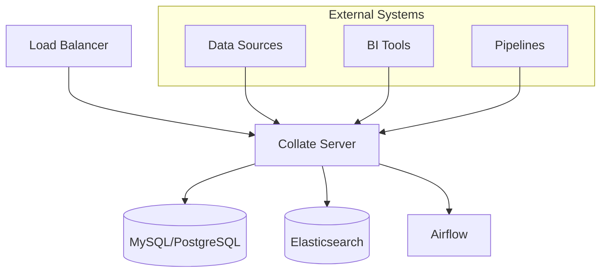

# Deployment Overview

Choose the right deployment option for your organization's needs.

## Deployment Options

<CardGroup cols={2}>
  <Card title="Docker Compose" icon="/public/images/icons/deploymentTile.svg" href="/deployment/docker">
    Single-node deployment for development and small teams
  </Card>
  <Card title="Kubernetes" icon="/public/images/icons/deploymentTile.svg" href="/deployment/kubernetes">
    Scalable deployment for production environments
  </Card>
  <Card title="AWS" icon="/public/images/icons/cloud.svg" href="/deployment/kubernetes/eks">
    Managed deployment on Amazon Web Services
  </Card>
  <Card title="GCP" icon="/public/images/icons/cloud.svg" href="/deployment/kubernetes/gke">
    Managed deployment on Google Cloud Platform
  </Card>
</CardGroup>

## System Requirements

### Minimum Requirements
- **CPU**: 4 cores
- **Memory**: 16 GB RAM
- **Storage**: 100 GB SSD
- **Network**: 1 Gbps

### Recommended for Production
- **CPU**: 8+ cores
- **Memory**: 32+ GB RAM
- **Storage**: 500 GB+ SSD
- **Network**: 10 Gbps
- **High Availability**: Multi-node setup

## Architecture Components

## Security Considerations

### Authentication
- **SSO Integration**: LDAP, Active Directory, OAuth
- **API Keys**: Secure service-to-service communication
- **JWT Tokens**: Stateless authentication

### Authorization
- **Role-Based Access**: Admin, Data Steward, Data Consumer
- **Fine-Grained Permissions**: Database, table, column level
- **Policy Management**: Centralized access control

### Network Security
- **TLS/SSL**: Encrypted communication
- **VPN/Private Networks**: Secure network access
- **Firewall Rules**: Restricted port access
- **Network Segmentation**: Isolated environments