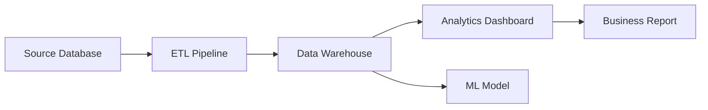

# Data Lineage

Understand how data flows through your systems with comprehensive lineage tracking.

## What is Data Lineage?

Data lineage shows the complete journey of data from source to destination, including all transformations and dependencies along the way.

## Lineage Views

### Column-Level Lineage
- Track individual column transformations
- Understand data derivations and calculations
- Impact analysis at the field level

### Table-Level Lineage
- See relationships between tables
- Understand data flow between systems
- Track ETL/ELT processes

### Pipeline Lineage
- Visualize data pipeline dependencies
- Track job executions and schedules
- Monitor pipeline health and performance

## Interactive Lineage Graph

## Impact Analysis

### Upstream Analysis
- Find all data sources feeding into an asset
- Identify potential data quality issues
- Understand data freshness and dependencies

### Downstream Analysis
- See all systems affected by changes
- Assess impact of schema modifications
- Plan maintenance windows effectively

## Automated Discovery

Collate automatically discovers lineage from:
- **SQL Queries**: Parse SELECT, INSERT, CREATE statements
- **Pipeline Tools**: Airflow, Prefect, Dagster integrations
- **BI Tools**: Tableau, PowerBI, Looker connections
- **API Calls**: Track data access through APIs