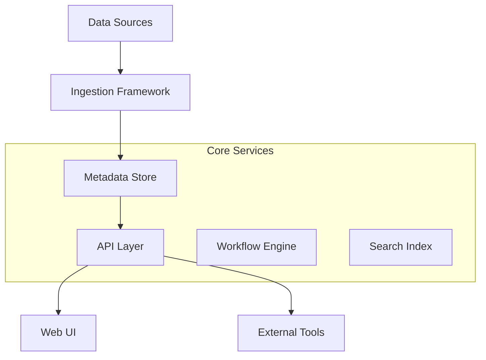

# Collate Overview

Collate is a unified metadata platform for data discovery, data lineage, data quality, observability, governance, and team collaboration.

## Core Components

### Metadata Store
- **Central Repository**: Stores all metadata in a unified schema
- **API-First**: RESTful APIs for all metadata operations
- **Version Control**: Track changes to metadata over time

### Data Discovery
- **Search & Browse**: Find data assets across your organization
- **Rich Context**: Business descriptions, tags, and glossary terms
- **Usage Analytics**: Understand how data is being used

### Data Lineage
- **End-to-End Tracking**: Follow data from source to destination
- **Impact Analysis**: Understand downstream effects of changes
- **Visual Representation**: Interactive lineage graphs

### Data Quality
- **Automated Testing**: Built-in data quality tests
- **Custom Rules**: Define your own quality metrics
- **Alerting**: Get notified when quality issues arise

## Architecture

## Key Benefits

<CardGroup cols={2}>
  <Card title="Unified Metadata" icon="/public/images/icons/puzzle.svg">
    Single source of truth for all your data assets
  </Card>
  <Card title="Data Discovery" icon="/public/images/icons/search.svg">
    Easily find and understand your data
  </Card>
  <Card title="Collaboration" icon="/public/images/icons/collaboration.svg">
    Enable teams to work together on data
  </Card>
  <Card title="Governance" icon="/public/images/icons/quality.svg">
    Implement data governance at scale
  </Card>
</CardGroup>